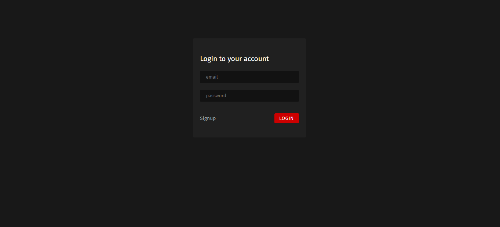
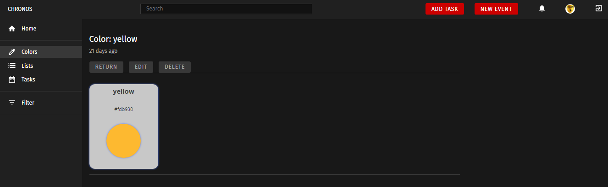

# CHRONOS
- Before start, you need to install PostgreSQL

> CREATE DATABASE (name db in file .env)
- Rename two file .env-example to .env
- Сhange file details .env

This project was bootstrapped with [Create React App](https://github.com/facebook/create-react-app).

## Available Scripts

In the project directory, you can run:

#### Enter command in terminal

### `npm i`

#### Start the server `npm run dev`

##### Backend server can be downloaded https://github.com/musampakiki/chronos.git

####Login

####Home page

####Tasks

####Task

####Add New Task

####Edit Task

####Event

####New event

####Lists

####List

####Color

####User edit

####Db example
